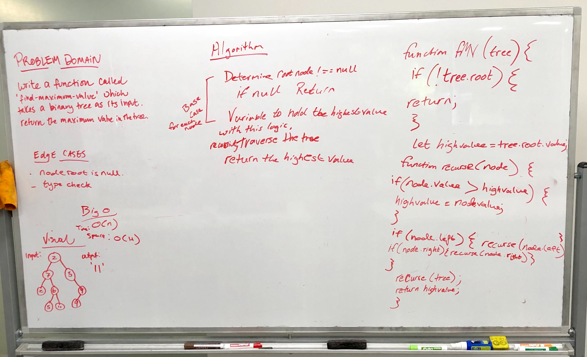

 Code Challenge 18- Find Maximum Value in a Binary Tree
==============================================

## Authors: Xochil Squaglia

### Links and Resources
* [repo](https://github.com/xochil73/data-structures-and-algorithms/tree/master/code-challenges/401/find_maximum_binary_tree)

### Challenge
* Create a function that finds the maximum value in a binary tree

### Approach
Create a value that equates the root to the the highest value. Then recursively traverse the binary tree, camparing that highest value to the current value.  Return the higehst value.

### Solution

### Tests

### Big O
* Time 0(n)
* Space 0(W)
