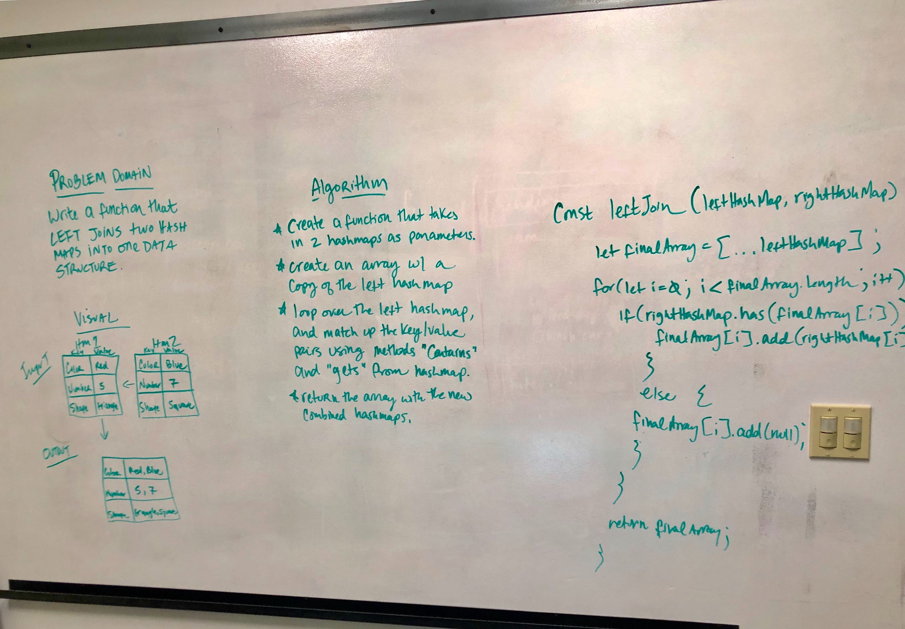

 Code Challenge 33- Left Join HashMaps
==============================================

## Authors: Xochil Squaglia

### Links and Resources
* [repo](https://github.com/xochil73/data-structures-and-algorithms/tree/master/code-challenges/401/breadth_first)

### To test server
* npm run test

### Challenge

Write a function that LEFT JOINS two hashmaps into a single data structure.

### Approach
Create a function that takes in two hash maps as it's parameter.  Create an array with the copy of the left hashmap.  Interate through the left hashmap while checking to see if the right hashmap `contains` the keys, and if so `get` them, if not, then return null.  Return the array with combined key/value pairs.

### Solution

