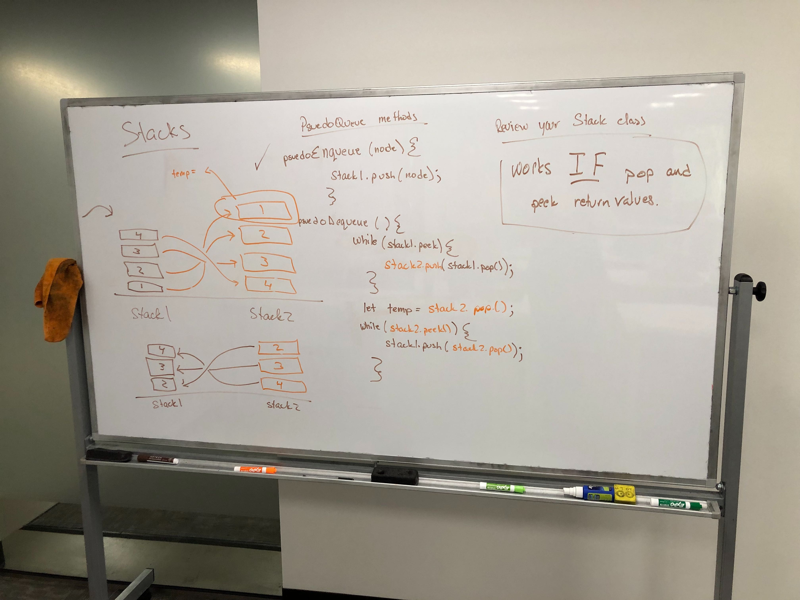

 Code Challenge 11- Queue With Stacks
==============================================

## Authors: Xochil Squaglia

### Links and Resources
* [repo](https://github.com/xochil73/data-structures-and-algorithms/blob/master/code-challenges/401/queueWithStacks/README.md)

### Challenge
* Create a pseudo-queue class that creates a queue using only two stacks and the FIFO method.

### Solution

### Big O
* Time 0(n)
* Space 0(H)